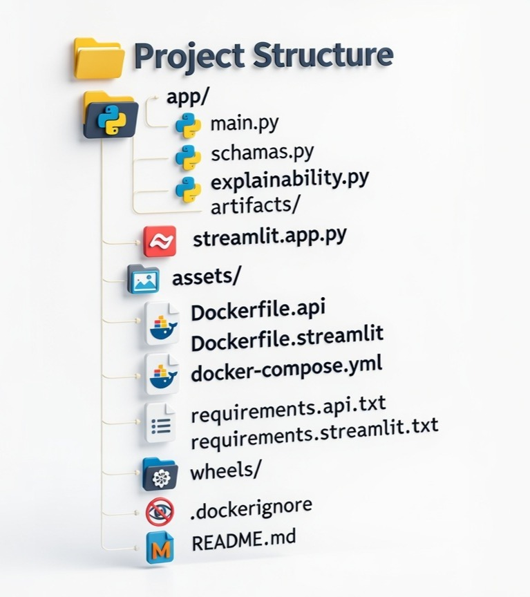

# **Motor Insurance Ultimate Claims Prediction Model**

 <!-- Optional: add if you have a logo in assets/ -->

##### Predicting **ultimate claim amounts** for motor insurance using early FNOL (First Notification of Loss) indicators, with **SHAP** and **LIME** explainability.

## 🎯 Project Objective

Develop a machine learning model and web application that:

- Predicts the **ultimate claim cost** shortly after an accident is reported (FNOL stage)

- Provides **interpretable explanations** (using SHAP and LIME) to help underwriters, claims adjusters, and fraud teams understand key risk drivers

- Enables fast, data-driven decisions to improve reserving accuracy, detect potential fraud, and optimize claims handling

**Business value**:

- Better financial reserving

- Early identification of high-severity / fraudulent claims

- Improved customer experience through faster settlements for low-risk cases

## 🛠️ Tech Stack

- **Backend**: FastAPI (Python)  

- **Frontend**: Streamlit  

- **Model**: Gradient Boosting Regressor (scikit-learn)  

- **Explainability**: SHAP (TreeExplainer), LIME (tabular)  

- **Containerization & Orchestration**: Docker + Docker Compose  

- **Deployment options tested**: Render, Railway.app, Oracle Cloud Always Free VM

---
### 📁 **Project Structure** _(Core Deployment Files)_

### 📊 **Model Performance & Results**
* **Model:** Gradient Boosting Regressor
* **Target:** Ultimate Claim Amount (log-transformed during training, exponentiated for final output)
* **Key metrics** _(on hold-out/test set – update with your actual numbers):_
  - **MAE:** 1,315.26 USD
  - **RMSE:** 3534.04 USD
  - **R²:** 0.9913
  - **MAPE:** 11.37%

* **Explainability Highlights:**
  - **SHAP Explainabilty:** Primary for global & local explanations. Top global drivers using SHAP summary for features like Estimated Claim Amount, Severity Score, Days to Settlement, Fraud Flag, Litigation Flag, Credit Score Band
  - **LIME:** Local confirmation. LIME often highlights non-linear thresholds (e.g., Severity Score > 3, Claim Duration < 30 days)

**Example Prediction Output:**
* **Input:** Claim Duration, Moderate severity, Young driver, Theft claim → Predicted ~ USD 1,961,300
* **SHAP** Shows strong negative impact from low severity + short settlement time

